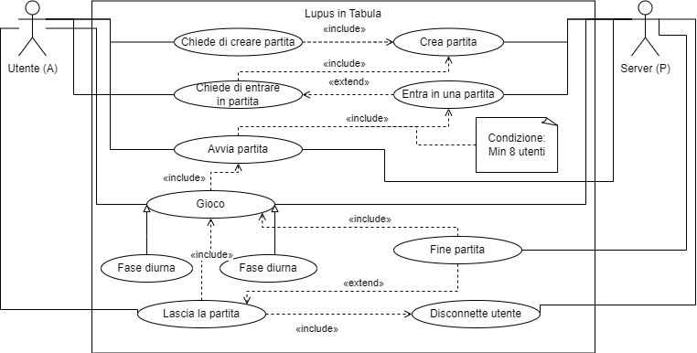

  

# Progetto di ingegneria del software (rev. 4.0)
### Anno accademico 2022-2023

### Membri del team
- Lorenzo Magni, matricola 1073257
- Marianna Romelli, matricola 1072382
- Saif Bouchemal, matricola 1074800

## Indice
- __0. Il progetto__
- __1. Project plan__
  - 1.1 Introduzione
  - 1.2 Modello di processo
  - 1.3 Organizzazione del progetto
  - 1.4 Standards, linee guida e procedure
  - 1.5 Attività di gestione
  - 1.6 Rischi
  - 1.7 Membri
  - 1.8 Metodi e tecniche
  - 1.9 Garanzie di qualità
  - 1.10 Package di lavoro
  - 1.11 Risorse
  - 1.12 Budget e pianificazione
  - 1.13 Cambiamenti
  - 1.14 Consegna
- __2. Software lifecycle__
- __3. Configuration management__
  - 3.1 Struttura del progetto
  - 3.2 Issues
- __4. People management__
- __5. Software quality__
  - 5.1 Operatività del software
  - 5.2 Revisione del software
  - 5.3 Transizione verso un nuovo ambiente
- __6. Requirement engineering__
- __7. Modelling__
  - 7.1 State machine diagram
  - 7.2 Use case diagram
  - 7.3 Class diagram
  - 7.4 Sequence diagram
  - 7.5 Acrtivity diagram
- __8. Software architecture__
- __9. Software design__
- __10. Software testing e manutenibilità__

## Il progetto
Realizzazione in Java di un gioco di ruolo multiplayer online basato sul noto gioco da tavolo [Lupus in Tabula](https://www.dvgiochi.com/catalogo/lupus-in-tabula). 
I giocatori sono divisi in due gruppi principali: i villici che hanno come scopo riconoscere e uccidere i lupi mannari e i lupi mannari che hanno come scopo divorare tutti i villici senza farsi scoprire.

### Guida rapida al gioco
#### Personaggi
- con __8 giocatori__ si hanno: 5 villici, 2 lupi mannari e 1 veggente
- con __9 o più giocatori__ si aggiungono carte a sufficienze scegliendo altri villici e/o personaggi speciali indicati di seguito
- con __16 o più giocatori__ si aggiungie un terzo lupo mannaro e carte a sufficienza scegliendo altri villici e/o personaggi speciali indicati di seguito

#### Ruoli
- __Villico__: durante il giorno, i villici votano per linciare un giocatore, durante la notte dormono.
- __Lupo mannaro__ (2-3): durante la notte divorano un villico, durante il giorno si comportano come normali villici.
- __Veggente__ (1): durante la notte può vedere se un giocatore è o meno un lupo mannaro.
- __Medium__ (1): durante la notte può vedere se il giocatore linciato il giorno prima era o no un lupo mannaro.
- __Indemoniato__ (1): è un umano ma parteggia per i lupi mannari senza sapere chi siano. Vince se vincono i lupi mannari.
- __Guardia del corpo__ (1): durante la notte può proteggere un giocatore da un attacco dei lupi mannari.
- __Gufo__ (1): durante la notte può può scegliere un giocatore da mandare al linciaggio. Giocando con 20+ giocatori, il gufo diventa "letale". Se il giocatore scelto non era un Mannaro (Lupo o Criceto) muore all'inizio del giorno.
- __Massone__ (2): durante la prima notte si svegliano e si riconoscono.
- __Criceto mannaro__ (1): il criceto mannaro non appartiene a nessuna squadra, gioca per sé stesso. Vince se sopravvive fino alla fine del gioco. Se visto dal medium risulta come umano, se visto dal veggente di notte muore insieme allo sbranato. Il criceto mannaro non può essere sbranato dai lupi.
- __Mitomane__ (1): alla fine della seconda notte il mitomane decide un giocatore da imitare. Se il giocatore scelto è un lupo mannaro diventa anch'esso un lupo mannaro, se era un veggente diventa anch'esso un veggente, altrimenti diventa un villico normale.

#### Svoglimento del gioco
Il gioco prevede due fasi che si alternano: il giorno e la notte. Durante il giorno i giocatori vivi discutono su chi siano i lupi mannari per linciarli, durante la notte invece il narratore (server) chiama i vari ruoli speciali che hanno la possibilità di compiere azioni. Il gioco termina quando i villici sono riusciti ad uccidere tutti i lupi mannari o quando i lupi mannari sono riusciti a rimanere in numero uguale a quello dei villici. 
Il giorno è diviso a sua volta in due fasi: la discussione, durante la quale i giocatori vivi discutono su chi possa essere un lupo mannaro e che termina con la votazione per scegliere i due giocatori che saranno mandati al linciaggio, e il linciaggio durante il quale i due giocatori accusati dovranno difendersi e uno dei due sarà votato e linciato.  

Per maggiori informazioni sul gioco è possibile consultare il manuale di gioco ufficiale disponibile [qui](http://www.laruzzoteca.it/ruzzoteca/upload/istruzioni/100.pdf).

## 1. Project plan
Si sviluppa il gioco pensando ad una community generica di videogiocatori. Nella fase iniziale del lavoro i requisiti sono decisi all'interno del team di sviluppo, mentre nel momento in cui l'applicazione sarà resa pubblica, gli utenti avranno una parte attiva nel suggerire modifiche e miglioramenti nonchè di segnalare eventuali bug attraverso le piattaforme social e/o issue di GitHub raggiungibili anche dall'interno del gioco. 

L'azienda che si occupa della produzione è una società di sviluppo software costituita da Lorenzo Magni, Marianna Romelli e Saif Bouchemal ed è stata costituita con il fine di progettare e sviluppare il software. 
L'obiettivo del lavoro è di pubblicare il gioco sulle piattaforme di redistribuzione di videogiochi, quali Steam o Epic Games, e/o renderlo disponibile per eventuali investitori interessati a finanziare il progetto. 

Inizialmente il lavoro del team di sviluppo sarà non salariato, in seguito alla distribuzione del gioco i guadagni ricavati dalle vendite e/o dagli investimenti verranno ripartiti tra i membri sulla base delle ore di lavoro svolte.

### 1.1 Introduzione
Dopo un'attenta analisi dei requisiti ideati dal team ponendosi nell'ottica di un possibile giocatore, sono stati stabiliti i passaggi da seguire al fine di realizzare una prima versione del sistema richiesto. 
Alla progettazione del gioco prenderà parte l'intero team, successivamente per la fase di sviluppo e scrittura di questa documentazione verranno stabiliti i ruoli e le responsabilità dei singoli membri. 

Durante la prima riunione operativa si è deciso di sviluppare un'applicazione desktop che implementi le seguenti funzionalità:
- Sviluppo di un gioco multigiocatore online
- Il gioco dovrà possedere una grafica piacevole, avere una chat testuale e possibilmente vocale
- Il gioco dovrà supportare più lingue
- Il gioco dovrà essere disponibile per Windows, Mac e Linux

All'interno della stessa si è stabilito che per tutto il periodo di progettazione e sviluppo si sarebbero tenuti degli incotri settimanali in modo da favorire la comunicazione e collaborazione tre i membri del team, nonchè per discutere sugli obiettivi e avere un feedback dell'intero gruppo di lavoro riguardo alle modifiche apportete. 
Si è inoltre posta come deadline per il primo prototipo il 30/12/2022 mentre per la versione alpha il 10/02/2023. 
In seguito alla pubblicazione del gioco in versione alpha sarà data la possibilità agli utenti di giocare gratuitamente per un periodo di tempo limitato e di mandare feedback riguardo al gameplay ed eventuali implementazioni e segnalarci eventuali bug.

### 1.2 Modello di processo
Per il processo di sviluppo del gioco si è deciso di sfruttare un approccio di tipo *agile*, infatti, si è ritenuto che questo fosse più adatto per un progetto di questo tipo in cui la documentazione non è essenziale per l'utente finale, ossia i giocatori. 
Il processo di sviluppo sarà strutturato nel seguente modo:
 - __Fase di sviluppo della versione alpha__
   Durante questa fase verrà sviluppata una prima versione del gioco con tutte le funzionalità di base necessarie al gameplay.
 - __Fase di manutenzione e aggiornamento__
   Durante questa seconda fase ci si occuperà di correggere eventuali bug e implementare nuove funzionalità del gioco. 
   Gli aggiornamenti potranno essere di due tipi: aggiornamenti minori che correggono bug e/o implementano nuove funzionalità minori, e aggiornamenti maggiori che implementano nuove funzionalità principali.

Come piattaforma di Version Control System si è scelto di sfruttare GitHub, in quanto è la piattaforma più utilizzata per lo sviluppo software ed è nota anche dagli utenti, inoltre permette di sfruttare le funzionalità di issue tracking, branch e wiki. 
Oltre allo scopo di bug tracker, si è deciso di sfruttare le *issue* per assegnare i task da svolgere ai membri del team e per tenere traccia dello stato di avanzamento del lavoro svolto. Una issue può essere chiusa solo in seguito alla conclusione del task (o alla correzione del bug) e al relativo aggiornamento del repository.

### 1.3 Organizzazione del progetto
Le persone coinvolte nella progettazione del gioco inizialmente sono quelle che compongono il team. In seguito alla pubblicazione, i giocatori potranno prendere parte allo sviluppo suggerendo nuove funzionalità o segnalando bug, o, se lo desiderano, potranno contribuire direttamente allo sviluppo facendo un *fork* del repository, implementando le loro modifiche e aprendo una *pull request*. Affinché le modifiche entrino a far parte del gioco dovranno essere revisionate e approvate dal team di sviluppo. 
Il team si incontrerà settimanalmente, o di persona o attraverso videoconferenza, per fare il punto sullo stato dei lavori e pianificare le attività da svolgere per la settimana successiva.

### 1.4 Standards, linee guida e procedure
Il gioco è composto da due applicativi separati:
- Server: Gestisce l'andamento di una o più partite, non possiede un'interfaccia grafica ed è compatibile con i più diffusi sistemi operativi (anche ARM)
- Client: Gestisce l'interfaccia grafica e l'interazione con l'utente

Sia server che client sono scritti in Java e per la comunicazione utilizzano la libreria open source [MCLib-Network](https://github.com/MultiCoreNetwork/MCLib) sviluppata da Lorenzo Magni e basata a sua volta sulla libreria [Netty](https://netty.io) per la comunicazione in rete tramite pacchetti TCP. 
Per la gestione dei file di configurazione e delle traduzioni si sfruttano file json mediante la libreria [Gson](https://github.com/google/gson) sviluppata da Google. 
Per la grafica si è deciso di utilizzare la libreria [JCEF](https://github.com/chromiumembedded/java-cef) che permette di integrare all'interno di una finestra Swing un browser *Chromium*. Si è deciso di utilizzare questo tipo di approccio in modo da semplificare lo sviluppo dell'interfaccia grafica mediante l'uso dei linguaggi web quali HTML, CSS e JavaScript e permettere una facile modifica (anche da parte degli utenti) delle interfacce del gioco. La scelta dei linguaggi web permette inoltre di avere un rescaling automatico delle interfacce in base alle dimensioni della finestra. 
Sempre per la grafica sono state utilizzate le librerie CSS/JS [Bootstrap](https://getbootstrap.com) e [jQuery](https://jquery.com) e [Font Awesome](https://fontawesome.com/) gestite localmente.

### 1.5 Attività di gestione
Si è deciso di organizzare lo sviluppo secondo la filosofia dell'*extreme programming* in quanto permette di migliorare la qualità del codice e approcciarsi al cambiamento dei requisiti in modo più responsivo. 
Sulla base di questo si è deciso di dedicare del tempo alla lettura del codice scritto dagli altri membri del team come metodo di validatzione, inoltre si è deciso di applicare l'approccio del *pair programming* per la scrittura del codice, con il quale si hanno coppie di sviluppatori che lavorano insieme su un singolo frammento di codice e si dividono il lavoro di scrittura e revisione in tempo reale. 
Gli incontri settimanali sono di breve durata, all'incirca 60 minuti, durante i quali possono essere effettuate delle sessioni di *brain storming* per trovare nuove idee o cercare soluzioni a problemi riscontrati. 
Ad ogni incontro, i membri del team dovranno esporre brevemente quali sono stati i task portati avanti durante la settimana antecedente e rendere noti agli altri eventuali problemi riscontrati. 
Al termine del meeting ci si accorda sui compiti da portare avanti durante le settimane successive.

### 1.6 Rischi
I principali rischi che si possono incontrare durante lo sviluppo di questo gioco con le modalità sopra descritte sono principalmente 2:
1. Il team potrebbe non essere in grado di raggiungere gli obiettivi prefissati entro la deadline. Il prolungamento della fase di programmazione corrisponde ad un aumento dei costi di sviluppo che nella fase iniziale non sono coperti.
2. Il gioco potrebbe non riscontrare l'interesse sperato da parte degli utenti o di potenziali investitori. In tal caso il tempo speso per lo sviluppo non potrà essere pagato.

### 1.7 Membri
La modalità di lavoro *agile* fa si che non ci sia una netta distinzione tra i ruoli nel gruppo di lavoro. I task e gli incarichi vengono decisi in comune accordo con il project manager e registrati come *issue* su GitHub. Di conseguenza, in comune accordo si è decisa la seguente assegnazione di ruoli generali:
- __Lorenzo Magni__: progettista software e sviluppatore back-end e front-end
- __Marianna Romelli__: project manager e responsabile della comunicazione
- __Saif Bouchemal__: sviluppatore front-end e responsabile del testing

### 1.8 Metodi e tecniche
La prima fase della progettazione è stata dedicata alla creazione di *use case diagrams* in modo da comprendere le funzionalità necessarie per la nostra applicazione.

  

L'attore principale è l'utente che può interagire in vari modi con l'applicazione. Nel caso in cui voglia avviare una partita, per prima cosa deve fare richiesta al server (attore passivo) di creare la partita, nel caso in cui voglia unirsi ad una partita già esistente deve fare richiesta di unirsi. Una volta creata una partita, affinché questa possa essere avviata sono necessari un minimo di 8 giocatori. Il gioco è composto da 2 fasi alternate distinguibili da una differente grafica e annunciate da un messaggio nella chat del gioco. Al raggiungimento delle condizioni imposte dal gioco, la partita termina e dopo essere stata mostrato il vincitore, l'utente può decidre se giocare nuovamente oppure uscire dalla partita ed essere disconnesso dal server.

### 1.9 Garanzie di qualità
Si punta a sviluppare un software che rispetti i parametri di qualità indicati dal modello di McCall:
- Correttezza
- Affidabilità
- Robustezza
- Integrità
- Usabilità

Per garantire la sicurezza degli utenti sono state usate librerie moderne e molto diffuse, aggiornate frequentemente e poco inclini ad avere vulnerabilità. 
Il software lato client è predisposto per essere aggiornato in maniera automatica in fase di avvio (o attraverso le piattaforme di redistribuzione) in modo da garantire che l'utente abbia sempre la versione più recente del software nella quale solitamente sono corretti i bug e rimosse eventuali falle nella sicurezza. 
Per chi desidere hostare un server privatamente si presuppone che abbia le competenze necessarie per farlo in modo sicuro e quindi per aggiornarlo autonomamente. 
La separazione tra client e server permette inoltre di avere due sistemi aggiornabili separatamente, in modo da poter rendere più reattiva la fase di aggiornamento e miglioramento del software.
Oltre a rispettare i *quality assurance* indicati dal modello McCall, si vuole avere un software sicuro che non metta a rischio la sicurezza e la privacy degli utenti. Per questo motivo si è deciso di non non raccogliere e registrare alcuna informazione personale degli utenti (fatta eccezione per l'indirizzo IP necessario per la comunicazione che comunque non verrà mai salvato). 
La chat del gioco sarà criptata end to end con una chiave generata in fase di connessione al server in modo da garantire che nessuno al di furoi dei giocatori possa leggere i messaggi inviati, inoltre per tutelare i giocatori più giovani è stato predisposto un filtro che censuri alcune parole e frasi che possono essere considerate offensive o inadeguate.

### 1.10 Package di lavoro
Il progetto del software è basato su maven e diviso in 3 moduli: *client*, *server* e *common*. Questo permette di avere una struttura ben organizzata, di poter avere un codice comune su client e server necessario per la comunicazione e di non avere codice inutilizzato sui lati (client o server). 
Il client contiene tutta la parte di codice necessaria per la visualizzazione del modello (view) e l'input/output da e verso l'utente, il server invece ha la funzione di controller e gestisce il modello (controller/model).

### 1.11 Risorse
Le risorse designate allo sviluppo del gioco sono un project manager e due sviluppatori. Il team ha deciso di utilizzare l'IDE [IntelliJ Idea](https://www.jetbrains.com/idea/) per lo sviluppo del software, la suite Office e gli strumenti di GitHub per la scrittura della documentazione e della presentazione e altri strumenti di photoediting per la creazione e modifica delle immagini del gioco e di grafici e diagrammi. 
Ogni membro del team ha a disposizione un computer personale, una connessione ad internet e un luogo di ritrovo fisico dove potersi incotrare. Per l'organizzazione del lavoro a distanza e dei meeting sono stati anche sfruttati [Discord](https://discord.com/) e [Monday](https://monday.com).

### 1.12 Budget e pianificazione
Come precedentemente specificato, il lavoro non è attualmente retribuito ma i possibili ricavi futuri verranno redistribuiti tra i membri del team in base al lavoro svolto. 
Le ore di lavoro sono così suddivise:
- __Lorenzo Magni__: ~ 80 ore
- __Marianna Romelli__: ~ 42 ore
- __Saif Bouchemal__: ~ 25 ore

### 1.13 Cambiamenti
Oltre alle features base incluse nella versione alpha, il team ha fissato come obiettivo l'aggiunta di funzionalità aggiuntive e nuove modalità di gioco per fornire un gioco più completo e variegato. 
Tra queste quelle preventivate fin dall'inizio sono:
- Traduzione del software in altre lingue oltre all'inglese e all'italiano
- Guida del gioco *ingame* per i nuovi giocatori
- Imposazioni personalizzabili della partita
- Chat vocale

### 1.14 Consegna
Una volta pronta la versione alpha, prima di essere pubblicato, verrà inviata una segnalazione tramite issue a tutti i membri del team in modo tale da poter effettuare un'ultima revisione prima della pubblicazione.

## 2. Software lyfecicle
Per il processo di sviluppo il team ha scelto un approccio di tipo *agile* poiché meglio si adatta alla metodologia di lavoro desiderata:
- Si considera importante il gruppo, le abilità dei sui membri e le loro interazioni. I lavori vengono assegnati in base alle capacità personali riducendo il tempo necessario allo studio di una competenza non conosciuta. Nel caso in cui un componente della squadra non sia in grado di portare a termine un task, il team si riunisce per trovare una soluzione.
- Nel team non c'è una struttura di tipo gerarchico, tutti i membri hanno la stessa importanza e possono esprimere le loro opinioni. Cià rende il gruppo più coeso.
- Si considera più importante un prodotto software funzionante piuttosto che una documentazione estremamente elaborata. Ciò consente di dedicare più tempo allo sviluppo e ottenere un prodotto pubblicabile in minore tempo con un risparmio di risorse. Nel caso sia necessario, la documentazione potrà essere espansa o modificata in seguito.
- Il team è organizzato secondo la filosofia dell'*extreme programming* e durante lo sviluppo si è sfruttato spesso il *pair programming* come metodo di verifica. I programmatori in coppia hanno lavorato sullo stesso frammento di codice in modo tale da avere una verifica in tempo reale sul lavoro svolto. Questa pratica ha inoltre favorito lo scambio di idee e la ricerca di soluzioni migliori.
- Durante lo sviluppo della versione alpha si è anche sfruttata la tecnica del *timeboxing* per la suddivisione dello sviluppo a intervalli temporali entro i quali determinate funzionalità devono essere implementate.
- Si è scelto di dare molta importanza alla collaborazione con gli utenti, infatti dopo aver messo appunto le funzionalità base dell'applicazione, si è deciso di dare la possibilità agli utenti di collaborare mediante suggerimenti e feedback o anche attivamente allo sviluppo degli aggiornamenti. Si è tuttavia deciso di non permettere agli utenti di prendere decisioni organizzative e tutte le modifiche e proposte devono essere approvate dal team.
- Il team è favorevole al cambiamento e si impegna a dedicare il giusto tempo alla pianificazione del futuro del software. In caso di grande richiesta da parte degli utenti finali (o di finanziatori) si è ben disposti a modificare il software in accordo con le loro esigenze. Unico limite a ciò è la denaturazione dei principi di base del gioco.

Dal punto di vista della progettazione del software si è deciso di attenersi ai seguenti modelli:
- *Model-Driven Architecture*: prima di procedere alla scrittura del codice sono stati costruiti dei modelli che rappresentassero le features desiderate e la loro implementazione
- *Data-Driven Architecture*: dove possibile le impostazioni e le funzionalità del gioco sono state implementate per essere facilmente modificabili tramite file json quindi facilmente modificabili anche senza dover aggiornare o ricompilare il software (Maggiori implementazioni saranno disponibili in versioni successive alla alpha)

## 3. Configuration management
Tutto il lavoro svolto, che si tratti di documentazione o di codice, viene regolarmente salvato nel repository di GitHub in condivisione con tutti i membri del team.

### 3.1 Struttura del progetto
Il repository è strutturato nel seguente modo:
 - __branches__:
   - *main*: Contiene le versioni stabili del codice e la documentazione
   - *dev*: Contiene le versioni in via di sviluppo del codice
 - __cartelle__:
   - *code*: Contiene il codice sorgente del progetto. È diviso in 3 moduli:
     + *common*: Modulo contenente le classi comuni a client e server
     + *client*: Modulo contenente le classi del client e le risorse grafiche
     + *server*: Modulo contenente le classi del server headless
   - *docs*: Contiene la documentazione del progetto
   - *.github/workflows*: Utilizzato per la configurazione dei workflow di GitHub Actions, testing, compilazione e distribuzione automatica

Durante lo sviluppo sono stati sfruttati anche altri branch, per la sperimentazione di tecnologie differenti o per la scrittura dei testing JUnit in parallelo allo sviluppo del codice. Questo è stato fatto per ridurre i conflitti che sarebbero potuti sorgere in un singolo branch. Questi branch una volta completata la loro funzione sono stati uniti ad altri branch o eliminati.

### 3.2 Issues
Nei vari meeting settimanali vengono creati i macro-temi che dovranno essere sviluppati nel corso della settimana seguente. Le varie attività sono create come issue, aggiungendo una breve descrizione del lavoro da svolgere, assegnandoli alla persona che si occuperà di quel lavoro e i relativi tag. Durante la settimana i membri del team sono liberi di creare nuove issue in base alle necessità. 
Le issue sono suddivise in 3 categorie principali:
- *task*: attività da svolgere
- *bug*: segnalazione di un bug
- *enhancement*: proposta di miglioramento

A seconda del loro avanzamento, i task possono trovarsi in diversi stati. Per tenere traccia di ciò è stata utilizzata una Board sulla piattaforma Monday. 
Gli stati sono i seguent:
- *Not started*: L'attività non è ancora stata iniziata
- *Working on it*: L'attività è in fase di sviluppo
- *To test*: L'attività è stata completata e deve essere testata
- *Testing*: L'attività è in fase di testing che comprende la scrittura di test JUnit o la verifica manuale
- *To fix*: L'attività è stata testata ma non funziona correttamente
- *Done*: L'attività è stata completata e funziona correttamente

## 4. People management
L'azienda ha deciso di basarsi sun una struttura organizzativa non gerarchica. Grazie a ciò ha una maggiore flessibilità e può adattarsi più facilmente alle esigenze del progetto. Inoltre tale struttura non ha una suddivisione prefissata del lavoro, è il team stesso a decidere come dividere e assegnare i vari task e, in caso di difficoltà, più membri possono affiancarsi per risolvere la problematica in gruppo. Il vantaggio di utilizzare l'adhocrazia permette anche di avere un clima più sereno e informale, utile per il benessere dei membri del team. 

Anche se non esite una distinzione tra i ruoli scritta, si è venuta a creare in maniera automatica la seguente suddivisione:

<table>
    <tr>
        <th></th>
        <th>Documentazione</th>
        <th>Progettazione</th>
        <th>Sviluppo back-end</th>
        <th>Sviluppo front-end</th>
        <th>Test</th>
    </tr>
    <tr>
    <th>Lorenzo Magni</th>
    <td></td>
    <td>✅</td>
    <td>✅</td>
    <td>✅</td>
    <td>✅</td>
    </tr>
    <tr>
    <th>Marianna Romelli</th>
    <td>✅</td>
    <td>✅</td>
    <td></td>
    <td></td>
    <td>✅</td>
    </tr>
    <tr>
    <th>Saif Bouchemal</th>
    <td></td>
    <td></td>
    <td></td>
    <td>✅</td>
    <td>✅</td>
    </tr>
</table>

## 5. Software quality
Come precedentemente specificato, il team si è prefissato di sviluppare un'applicazione che rispetti i parametri e gli attributi di qualità definiti da McCall-Richards-Walters nel documento redatto nel 1977. Di seguito sono elencati suddivisi in categorie come indicato dagli autori.

### 5.1 Operatività del software
- __Correttezza__: L'applicatzione soddisfa i requisiti e le specifiche stabilite a inizio lavoro. Le funzionalità non ancora implementate lo saranno in futuri aggiornamenti del software.
- __Affidabilità__: L'applicazione è stata testata mediante strumenti e metodologie diverse e presenta il minor numero di bug possibile.
- __Efficienza__: Le risorse utilizzate dal client sono limitate, non vi è la necessità di un hardware potente o una grande quantità di RAM e il peso dell'applicazione è limitato a pochi MB. Il protocollo di comunicazione con il server è altrettanto leggero di conseguenza non richiede una connessione particolarmente veloce e una grande quantità di dati. Questo è stato ottenuto anche grazie allo spostamento del carico sul server.
- __Integrità__: Il software è sicuro in quanto non vengono sfruttati servizi esterni, non vengono raccolti dati personali e la chat è criptata end-to-end con una chiave dinamica.
- __Usabilità__: Il prodotto è semplice da utilizzare, infatti non sono richieste particolari abilità per poterne usufruire. L'uso dell'applicazione è facilitato su tutte le piattaforme grazie all'utilizzo di librerie specifiche per ogni sistema operativo in modo da sfruttare una grafica semplice e uniforme su tutte le piattaforme. Unico requisito (prima della pubblicazione su piattaforme di distribuzione) è l'installazione manuale di Java 17 o versioni successive.

I requisiti base del software sono i seguenti:
- Avere un pc con sistema operativo Windows, Linux o MacOS
- Avere una connessione a internet
- Avere una scheda video (anche integrata)
- Avere una conoscenza minima del gioco di ruolo a cui ci si sta per approcciare

### 5.2 Revisione del software
- __Manutenibilità__: La fase di individuazione degli errori è semplificata dalla scelta di separare i lati server client e dall'introduzione di un sistema di logging attivabile avviando il programma in modalità di debug. Il processo è inoltre facilitato dal fatto che il codice è strutturato secondo il paradigma *model-view-controller (MVC)* grazie al quale è possibile focalizzarsi su una singola parte del codice in base alla provenienza del bug.
- __Testabilità__: Tutte le funzionalità incluse sono testabili in qualunque momento tramite test manuali (mediante l'uso dei logger) e automatici.
- __Flessibilità__: Come per la manutenibilità, la scelta della struttura del progetto semplifica la fase di modifica o implementazione di nuove funzionalità rendendolo molto flessibile.

### 5.3 Transizione verso un nuovo ambiente
- __Portabilità__: Il gioco è nativamente eseguibile sui più diffusi sistemi operativi desktop (Window, Linux, MacOS) dotati di una connessione internet e un hardware relativamente recente. Il server è in grado di funzionare su qualsiasi titpo di dispositivo senza particolari limiti. La scelta di basare la grafica su linguaggi web è anche vantaggiosa nel caso in cui si volesse portare il gioco su altre piattaforme quali smarthpone e tablet, console o in versione web senza la necessità di effettuare troppe modifiche.
- __Riusabilità__: Sono state sfruttate e scritte librerie ad hoc per la scrittura dell'applicazione. Tali librerie possono essere riutilizzate in altri ambiti in quanto sono state sviluppate in modo indipendente dal contesto del gioco.

## 6. Requirement engineering